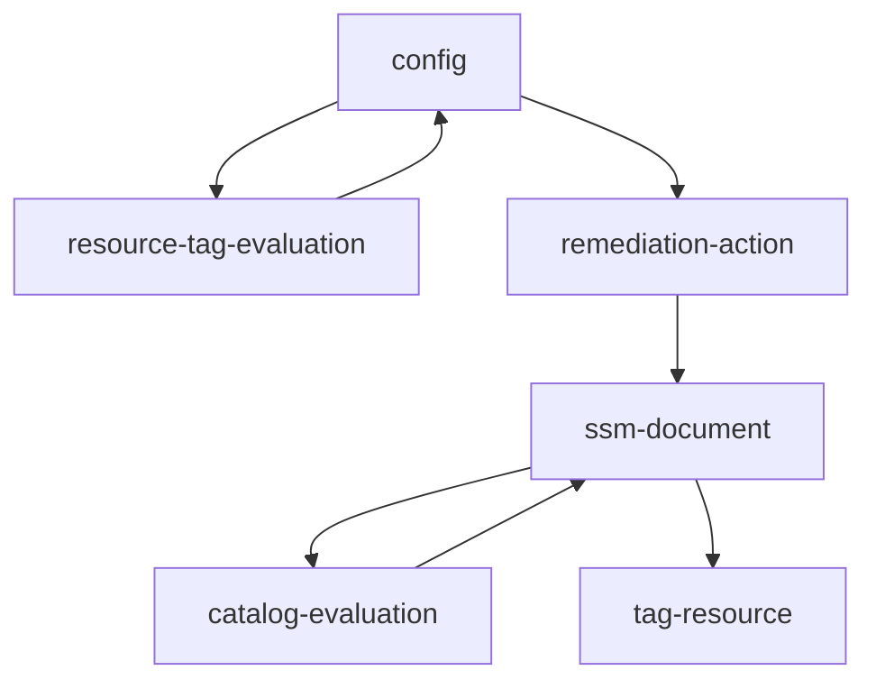
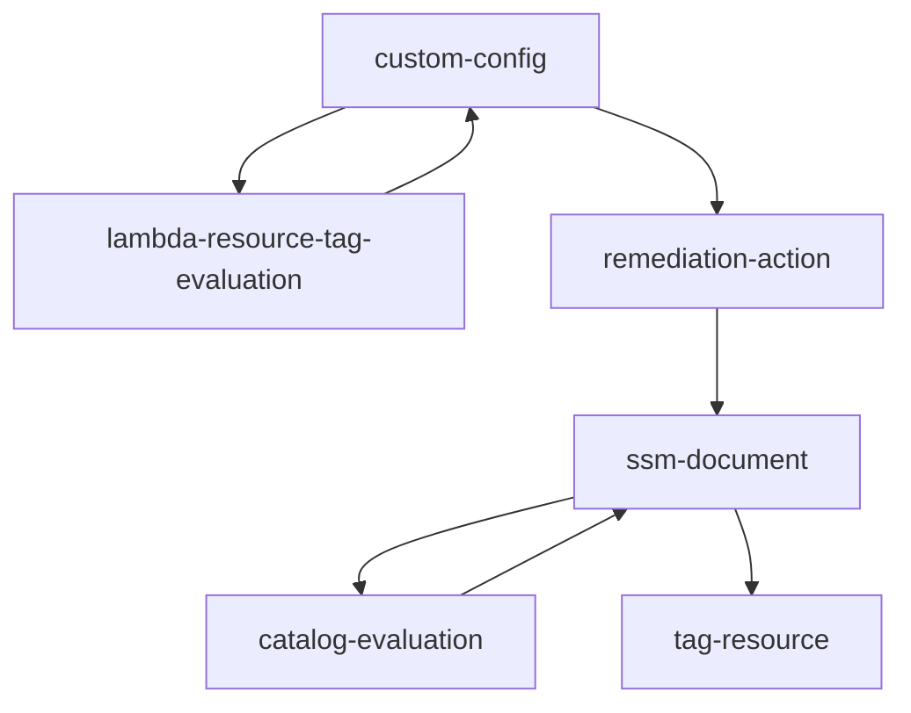
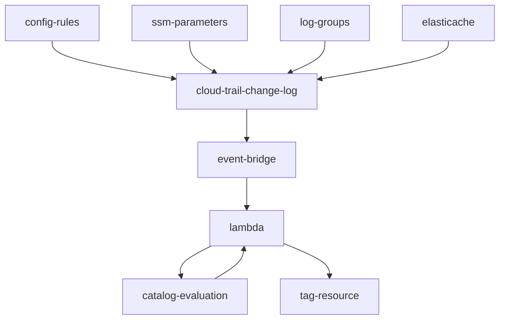

# Overview
TagConformancePack is a Terraform project designed to deploy an AWS Conformance Pack. 
It leverages AWS Config to enforce compliance with certain tagging standards across AWS resources. 
This project integrates AWS Managed Config Rules, custom AWS Lambda functions, and AWS EventBridge for automated 
compliance checks and actions.

## TL;DR
Para utlizar o módulo, o exemplo `multiple-accounts-deploy` pode ser consultado. Um exemplo de variáveis de ambiente
para o módulo pode ser consultado abaixo:

obs: utilizar a pasta scr no modulo para o terraform. Copiá-la e utilizar seus scripts.

```terraform
profile                 = "DEMO" #account name, do not change
bucket_name             = "tag-conformance-pack-files-demo-qa"
create_tf_backend          = false
region                  = "us-east-1"
application_domain_path = "./accounts/demo_account/application-domain.json"
script_path = "./src"
custom_lambda_script = "custom-required-tags-evaluation.py"
create_event_bridge_tagger = true
event_bridge_tagger_script = "event_bridge_tagger.py"
ssm_script = "ssmDocumentAutomation.py"
tags = {
  application = "config"
  domain      = "infrastructure"
  board       = "demo"
  company     = "company"
  shared      = "no"
  env         = "qa"
  tag_created = "iac"
}
RemediationExecutionControls = {
  ExecutionControls = {
    SsmControls = {
      ConcurrentExecutionRatePercentage = 20
      ErrorPercentage                   = 40
    }
  }
  Automatic                = true
  MaximumAutomaticAttempts = 1
  RetryAttemptSeconds      = 1200
}

# supported resources for required-tags managed config rule
# https://docs.aws.amazon.com/config/latest/developerguide/required-tags.html
resource_types = [
...
]

# all supporter resources
# https://docs.aws.amazon.com/config/latest/developerguide/resource-config-reference.html
custom_lambda_resource_types = [
...
]
  

```

## Project Structure

```
.
└── module/
    └── tag-conformance-pack/
        ├── conformance-pack.tf
        ├── custom_lambda_config
        ├── data.tf
        ├── backend.tf
        ├── iam.tf
        ├── lambda_event_bridge_tagger.tf
        ├── locals.tf
        ├── outputs.tf
        ├── s3.tf
        ├── ssm.tf
        ├── variables.tf
        └── versions.tf
```
## Tag Conformance pack

O módulo terraform tag conformance pack vai representar um aws conformance pack contendo 2 aws config rules (custom lambda e required-tags managed rule) e 1 função lambda com triggers a partir do event bridge para 4 recursos não suportados pelo aws config (cloudwatch log groups, elasticache, aws config rules e ssm parameters).

### Conformance Pack

O conformance pack não é um agregador do aws config, mas representa um conjunto de aws config rules e remediation actions em um único objeto.

### AWS Config - required tags

O aws config required-tags é uma regra gerenciada pela aws e apesar de ser um mecanismo pronto, possui limitação de recursos suportados.

input: 

cloudformation:

- config rule
- config rule remediation
- script do ssm document
- iam permissions
- catálogo de tags em formato json
- tags board, company, rd, shared e tag_created na variável tags = {}


Solução pronta da aws: aws config required-tags (managed rule). Possui quantidade limitada de recursos. Quando um recurso é criado ou modificado é avaliado sua conformidade com as tags. Para recusos fora de conformidade é disparada a ação de remediação e executado o script python via ssm document automation. O script tagueia o recurso conforme as tags do catálogo.

## Custom lambda required-tags config

O custom lambda required-tags é uma regra do aws config customizada. É implementada uma função lambda que realiza a validação das tags para cada recurso avaliado e para os recursos fora de compliance é disparada uma ação de remediação via ssm document automation da mesma forma que a regra gerenciada da aws. Ambos, esta regra do aws config e a regra gerenciada estão contidas no conformance pack. Este recurso abrange todos os [recursos suportados pelo aws config](Iniciativas%2046509273c2284bb0870fa758affd34c1/Company%20-%20Squad%20FinOps%205c1ceba1ca5845abb0d0d888682d4adf/Board%20Temp%20b2c1ec192de84bdbb5843872d4495fc8/RD%20MultiCloud%20Tagueamento%20-%20TMC%205866e19979f9419096b471f57a013a2e.md).


AWS custom lambda. Funciona para todos os recursos suportados para o aws config. A função lambda realiza a checagem de tags dos recursos quando são modificados. É preciso implementar as apis para taguear cada recurso no script.

# Event bridge tagger

O event bridge tagger é um conjunto de componentes. É essencialmente uma função lambda com event bridge triggers. A  função lambda  dispara a partir dos eventos registrados no cloud trail para config rules, ssm parameters, log groups e elasticache clusters. A rule do event bridge vai monitorar criação do recurso e modificação das tags.


função lambda que funciona de forma parecida ao aws config. Contempla recursos não suportados pelo aws config. O eventBridge vai monitorar modificações nos recuros  então dispara a função lambda para analisar e taguear o recurso.

## Debug

#### Tag conformance pack
O ssm document pode ter seus logs de execução observados em ssm > automations.

1. Erro de catálogo. O erro abaixo indica que falta informação no catálogo para o recurso em questão.
```shell
# fix erro ssm automation - update de tags no catalogo
application_value = matching_item.get("application", "")
```
2. Erro de acesso
Se houver erro de acesso, será explicitado nos logs de execução

3. Erro na ação de tagueamento de recurso espećifico
Se houver problema na implementação, para cada api terá um erro específico demonstrando o 
problema. Pode ser necessário ajuste no python script.

4. Erro ao tentar coletar as tags do recurso
Para cada api haverá uma resposta padrão indicando este problema. Pode ser necessário
ajuste no python script.

| variáveis | tipo | descrição | default |
| --- | --- | --- | --- |
| profile | string |  |  |
| bucket_name | string | nome do bucket para o backend |  |
| create_tf_backend | bool | se um bucket s3 deve ser criado para o backend | false |
| create_tf_backend_dynamo_table | bool |  | false |
| region | string |  |  |
| application_domain_path | string | direotiro do catalogo application-domain.json |  |
| script_path | string | diretorio onde estao todos os scripts |  |
| custom_lambda_script | sring | nome do script do custom lambda |  |
| create_event_bridge_tagger | bool |  | false |
| event_bridge_tagger_script | string | nome do script da lambda do tagguer do event bridge |  |
| ssm_script | string | nome do script ssm |  |
| tags | map | mapa de tags, deve conter as tags de finops |  |
| RemediationExecutionControls | object() |  |  |
| ConcurrentExecutionRatePercentage | string |  | 20 |
| ErrorPercentage | string | % de erro tolerado para a remediação | 40 |
| Automatic | bool | se a ação de remediação é automatica | false |
| MaximumAutomaticAttempts | num |  | 1 |
| RetryAttemptSeconds | num |  | 1200 |
| resource_types | list | llista de recursos a serem avaliados pelo aws config managed rule required-tags |  |
| custom_lambda_resource_types | list | lista de recursos a serem avaliados pelo custom lambda |  |
| script_policy | json | policy permissionandoas actions de taguear e listar recursos para o aws config, ssm document  e lambda. |  |
